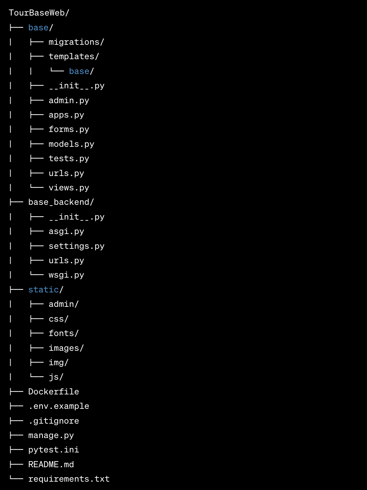

# TourBaseWeb

TourBaseWeb — это веб-приложение туристической базы, предназначенное для управления и организации туристических услуг. 
Проект включает в себя функционал для бронирования, управления клиентской информацией и интеграции с Telegram для уведомлений о заявки на бронирование.


## Структура проекта 




__base/__
Основное приложение, включает в себя все основные компоненты приложения:

- migrations/: Папка с миграциями базы данных Django.
      - templates/: Хранит HTML шаблоны приложения.
      -  base/: Шаблоны специфичные для основного приложения.

- admin.py: Настройки административной панели Django.

- apps.py: Конфигурация приложения Django.

- forms.py: Определения форм Django.

- models.py: Определения моделей данных.

- tests.py: Тесты для приложения.

- urls.py: Определения маршрутов URL приложения.

- views.py: Определения представлений приложения.

__base_backend/__

Конфигурационный модуль для всего проекта:

- asgi.py: Точка входа для ASGI-совместимых веб-серверов.
- settings.py: Настройки проекта Django.
- urls.py: Глобальные маршруты URL проекта.
- wsgi.py: Точка входа для WSGI-совместимых веб-серверов.

__static/__

Папка со статическими файлами (CSS, JavaScript, изображения):

- admin/, css/, fonts/, images/, img/, js/: Директории для различных видов статических файлов.

Корневая директория

- .env.example: Шаблон файла для переменных окружения.

- .gitignore: Список файлов и директорий, игнорируемых Git.

- manage.py: Утилита командной строки Django для управления проектом.

- pytest.ini: Конфигурация для тестирования с использованием pytest.

- README.md: Описание проекта (этот файл).

- requirements.txt: Список зависимостей Python для проекта.


### Установка и запуск

Для установки и локального запуска проекта выполните следующие шаги:

*Клонирование репозитория:*

```sh
git clone <URL репозитория>
cd TourBaseWeb
```

*Создание виртуального окружения и установка зависимостей:*


```sh
python -m venv venv
source venv/bin/activate  # Используйте venv\Scripts\activate на Windows
pip install -r requirements.txt

```

*Настройка переменных окружения:*

Создайте файл .env на основе предоставленного шаблона и заполните его соответствующими значениями.

*Выполнение миграций:*

```sh
python manage.py migrate

```


*Запуск сервера разработки:*

```sh
python manage.py runserver

```

*Открытие веб-приложения в браузере:*

Перейдите по адресу http://127.0.0.1:8000 в вашем браузере.


### Тестирование

Выполните тесты, используя команду:


```sh
pytest

```
